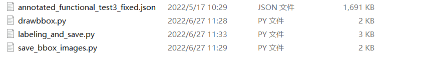
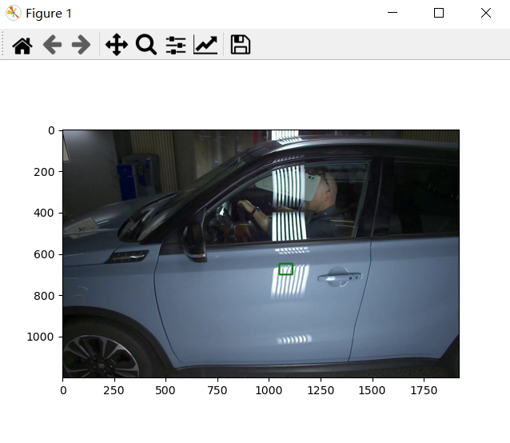
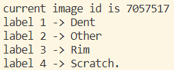
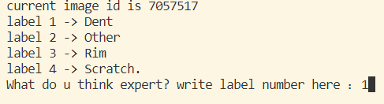
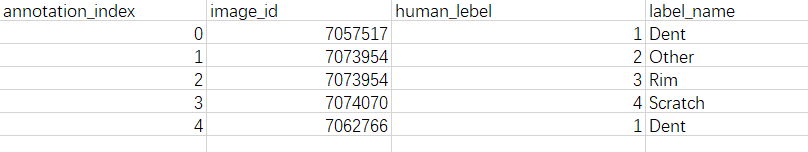
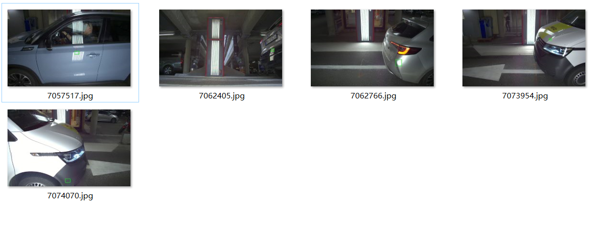

# Label Tool

## Contents  
- [Environment](#Environment)  
- [Structure](#Structure)  
- [Usage Description](#Usage-Description) 
- [Results](#Results) 

## Environment
* Python 3.7.11
* opencv-python
* The code is tested on Python 3.7.11, with operating system Windows.


## Structure

  ├── [labeling_and_save.py](./labeling_and_save.py): Allow Experts label and save labels in csv. Main function  
  ├── [drawbbox.py](./drawbbox.py): draw bbox online without save and show images with bbox. Subfunction  
  └── [save_bbox_images.py](./save_bbox_images.py): save images with bbox but no show. Subfunction  

## Usage Description
* Clone or download three py files.  
* Add files to your datasets folder. Same path as annotated_functional_test3_fixed.json.  

* Change label range as u want. u can find following code at [labeling_and_save.py](./labeling_and_save.py) line 37  
```
 #  for idx in range(len_annotation):
 # you can change labeling range here!
 for idx in range(0,5):
 # u can change to (50,100) for example.
```  
* Run function [labeling_and_save.py](./labeling_and_save.py)  
* Remember the damage type in the box based on the image and the label classification hint below.  
  
  
* Close image and enter label number like 1 ,2, 3, 4.  Type 'enter' on keyboard for next image.

* You can set a smaller labeling range if you want to complete the  task in several times. Remember to change the csv file path every time. u can find following code at [labeling_and_save.py](./labeling_and_save.py) line 59  
```
data_df = pd.DataFrame(data)
data_df.to_csv('label.csv',index=False,header=True)
# change 'label.csv' to 'label_2.csv' to avoid overwrite original csv.
print("csv_file saved")
```  
* Enjoy and have fun!   

## Results
* After the run ends, you will get a csv file named 'label.csv'.  

* And a folder named 'saved_images_with_bbox' with images and bboxes.

