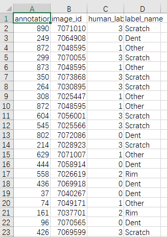

# CNN with Active Learning

## Contents  
- [Environment](#Environment)  
- [Structure](#Structure)  
- [Usage Description](#Usage-Description) 
- [Results](#Results) 
- [Algorithm](#Algorithm)
- [Problems and Solutions](#Problems-and-Solutions) 

## Environment
* Python 3.7.11
* Pytorch 1.10.2
* The code is tested on Python 3.7.11, with operating system Windows.


## Structure

  ├── [AL_CNN_one.py](./AL_CNN_one.py): Involved fetch and crop image, train, val and test model all in one.  
  ├── [AL_CNN_train.py](./AL_CNN_train.py): Involved train, val and test model but get images from another existed file.  Same function as [AL_CNN_one.py](./AL_CNN_one.py)  
  ├── [DataPreprocess_color_224.py](./DataPreprocess_color_224.py): Save cropped images at Annotated_images_224.   
  └── [Results](./Results): Save diagrams and txt, csv results   

## Usage Description
#### [AL_CNN_one.py](./AL_CNN_one.py)

* Clone or download files.  
* Add files to your datasets folder. Same path as annotated_functional_test3_fixed.json.  

* Change Val_set size as u want. u can find following code at [AL_CNN_one.py](./AL_CNN_one.py) line 30 
* Change how many imgs are taken in each AL process. u can find following code at [AL_CNN_one.py](./AL_CNN_one.py) line 460
* Change how many imgs Al takes in 800 val_set. u can find following code at [AL_CNN_one.py](./AL_CNN_one.py) line 461
* Change how many CNN epoch does each AL process take. u can find following code at [AL_CNN_one.py](./AL_CNN_one.py) line 462
* Change select_list of AL selection methods. u can find following code at [AL_CNN_one.py](./AL_CNN_one.py) line 465
* Run function [AL_CNN_one.py](./AL_CNN_one.py)
* Enjoy and have fun! 

#### [AL_CNN_train.py](./AL_CNN_train.py)

* Clone or download files.  
* Add files to your datasets folder. Same path as annotated_functional_test3_fixed.json.  

* Run function [DataPreprocess_color_224.py](./DataPreprocess_color_224.py) to get Img_set file.
* Change Val_set size as u want. u can find following code at [AL_CNN_train.py](./AL_CNN_train.py) line 29  
* Change how many imgs are taken in each AL process. u can find following code at [AL_CNN_train.py](./AL_CNN_train.py) line 476  
* Change how many imgs Al takes in 800 val_set. u can find following code at [AL_CNN_train.py](./AL_CNN_train.py) line 285  
* Change how many CNN epoch does each AL process take. u can find following code at [AL_CNN_train.py](./AL_CNN_train.py) line 286  
* Change select_list of AL selection methods. u can find following code at [AL_CNN_train.py](./AL_CNN_train.py) line 478
* Run function [AL_CNN_train.py](./AL_CNN_train.py)
* Enjoy and have fun!  

## Algorithm  

* All images in algorithm is represented by dataframe index.  
* Actually, u have a set images for train, u split it in Val and Test. Each form a dataframe with all info about imgs.  
* Then u use some selection method choose uncertain imgs from Val, then those imgs form the original Train, Val delete those imgs.
* When u get Train, u put them in CNN for Epochs.  
* After training, u do test. And u select img from reset of Val, and add them to Train.  
* Until u select enough img from Val u stop.  

Image Credit:[The pool-based active learning cycle](http://burrsettles.com/pub/settles.activelearning.pdf)
* Active Learning can keep Usage of imgs as less as possible.  


## Results  
* After each AL process ends, u will get following results at cmd.    

* After all AL process ends, u will get following results at cmd.  

* Run [AL_CNN_train.py](./AL_CNN_train.py) with all 4 selection takes about 210mins for GTX1650.  

* After each selection methods, diagrams, csv with used imgs, pkl with best acc model parameters and txt with results are saved in save path.  

* Diagrams shows loss and Accuracy.  


* Csv saves used imgs for AL.  

* Txt saves results. 
 
* Final diagrams shows all four selection methods loss and accuracy.  
 
 

#### Best results so far is MinStdSelection. Use 461 non-repeating imgs reach 82.93% Accuracy.  
* Each classes all have rather good results.
```
Best Accuracy of Dent : 71.875
Best Accuracy of Other : 66.66666666666667
Best Accuracy of Rim : 97.10144927536231
Best Accuracy of Scratch : 83.05084745762711

```


## Problems and Solutions
* Train sample inbalanced solved by directly adding same samples to train.  
```
# Before oversampling
Accuracy of  Dent : 71 %
Accuracy of Other : 15 %
Accuracy of   Rim : 100 %
Accuracy of Scratch : 76 %

```
* [AL_CNN_one.py](./AL_CNN_one.py) don't need extra space to save cropped imgs.  
* Added random flip to images.   
```
transform = transforms.Compose([transforms.ToPILImage(),#transform will not change
    transforms.Resize((224, 224)), 
    transforms.RandomHorizontalFlip(p=0.5), # random flip for more generally model
    transforms.ToTensor(),
    transforms.Normalize(mean = (0.485, 0.456, 0.406), std = (0.229, 0.224, 0.225))])
```
* Added training time for prediction in following steps.  
* Save best acc model and parameters.  
* Added Accuracy for each classes.  
* Save imgs and results for each selection method.  
* When new imgs added, only 461 images needed to save for training with new imgs.  

#### Written by Huiyu Wang 23.07.2022