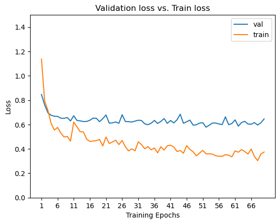
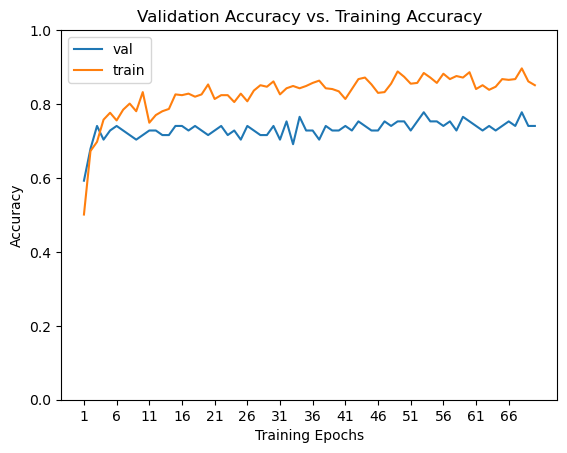
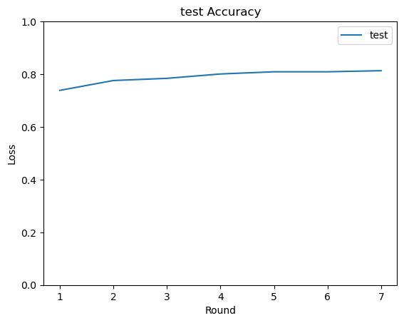
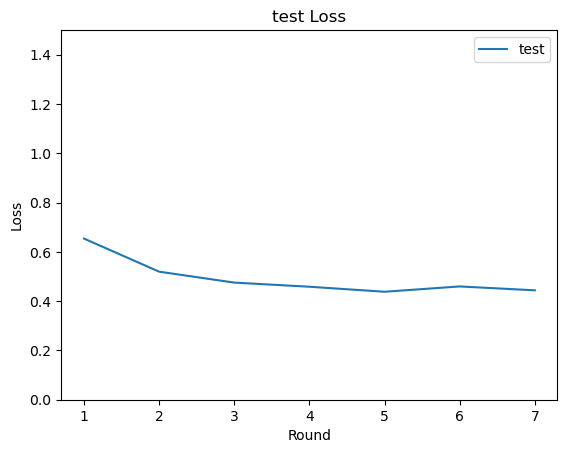

# Resnet_18

## Contents  
- [Environment](#Environment)  
- [Structure](#Structure)  
- [Usage Description](#Usage-Description) 
- [Results](#Results) 


## Environment
* Python 3.7.11
* Pytorch 1.10.2
* The code is tested on Python 3.7.11, with operating system Windows.


## Structure

  ├── [main.py](./main.py): Train Resnet18 model.      
  ├── [sample_split_new.py](./sample_split_new.py): Split dataset in the same form with Resnet_AL and save index in txt.    
  └── [results](./results): Save diagrams results.   

## Usage Description
#### [main.py](./main.py)

* Clone or download files.  
* Download WENN dataset. 
* Add files to your datasets folder. Same path as annotated_functional_test3_fixed.json.   
* Run function [sample_split_new.py](./sample_split_new.py)  
* Run function [main.py](./main.py)
* Enjoy and have fun! 


## Results  
* Train:Val:Test = 6:1:3
* Train and Val loss    

* Train and Val Acc      

* Test Acc Highest with 81.33%, nearly as high as AL with only 255 train data.        

* Test Loss      


``` 

#### Written by Huiyu Wang 01.09.2022