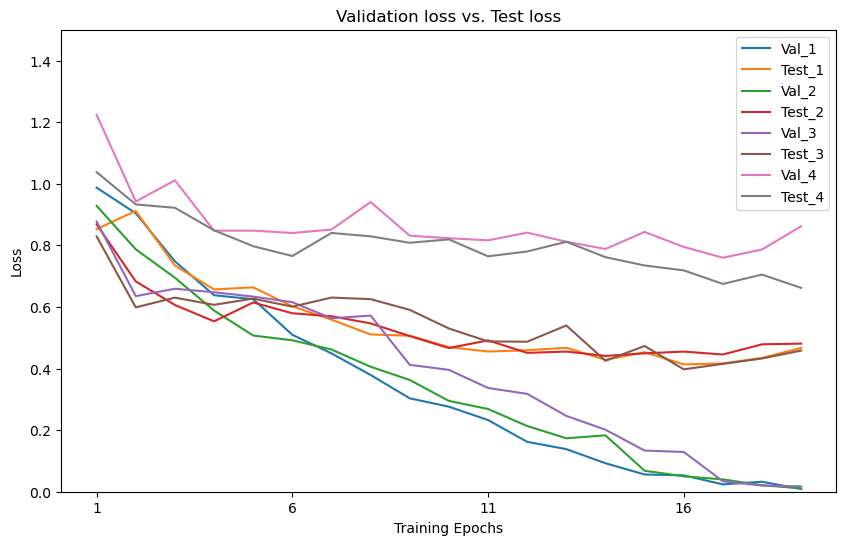

# Resnet_AL

## Contents  
- [Environment](#Environment)  
- [Structure](#Structure)  
- [Usage Description](#Usage-Description) 
- [Results](#Results) 
- [Algorithm](#Algorithm)

## Environment
* Python 3.7.11
* Pytorch 1.10.2
* The code is tested on Python 3.7.11, with operating system Windows.


## Structure

  ├── [main.py](./main.py): Train model and compare effects of different AL sampling methods.    
  ├── [src](./src): Dataset and subfunctions.  
  ├──── [WENN_dataset.py](./src/WENN_dataset.py) create WENN dataset and get imgs per index.  
  ├──── [model_parameter.py](./src/model_parameter.py) set up model.  
  ├──── [fetch_image.py](./src/fetch_image.py) Get cropped images according to Annotations from WENN dataset and save in folder.  
  ├──── [select_image.py](./src/select_image.py) Sample most uncertain images using AL sampling methods and return index.  
  ├──── [creterion.py](./src/creterion.py) Create matrix to calculate TN TP FN FP.  
  ├── [Labels](./Labels): Manually labels csv file. 
  └── [results](./results): Save diagrams and txt, csv results.   

## Usage Description
#### [main.py](./main.py)

* Clone or download files.  
* Download WENN dataset.  
* Copy WENN dataset path and paste at [main.py](./main.py) line 292
* Choose what AL sampling methods to be used at [main.py](./main.py) line 291. 
* Choose how many images are sampled at each round of AL at [main.py](./main.py) line 293.
* Enjoy and have fun! 


## Algorithm  

* All images sets in algorithm are represented by dataframe index.  
* Actually, u have a set images for train, u split it in Val and Test. Each form a dataframe with all info about imgs.  
* Then u use some selection method choose uncertain imgs from Val, then those imgs form the original Train, Val delete those imgs.
* When u get Train, u put them in CNN for Epochs.  
* After training, u do test. And u select img from reset of Val, and add them to Train.  
* Until u select enough img from Val u stop.  

Image Credit:[The pool-based active learning cycle](http://burrsettles.com/pub/settles.activelearning.pdf)
* Active Learning can keep Usage of imgs as less as possible.  


## Results  
* After each AL process ends, u will get following results at cmd.    

* Run [main.py](./main.py) with all 4 sampling methods takes about 110mins for GTX1650.  
* After each sampling methods, diagrams, csv with used imgs, pkl with best acc model parameters and txt with results are saved at path [results](./results).  
* Diagrams shows loss and Accuracy.  


* Matrix of best result.  

* Csv saves used imgs for AL.  
[AL_20_limit80accuracy_0.8091_images_255select_3.csv](./results/AL_20_limit80accuracy_0.8091_images_255select_3.csv)
* Txt saves results. 
[AL_20_limit80accuracy_0.8091images_255select_3.txt](./results/AL_20_limit80accuracy_0.8091images_255select_3.txt) 
* Final diagrams shows all four selection methods loss and accuracy.  
 
 

#### Best results so far is MinStdSelection. Use 255 non-repeating imgs reach 81.25% Accuracy.  
* Each classes all have rather good results.
```
Best Accuracy of Dent : 84.41558441558442
Best Accuracy of Other : 43.75
Best Accuracy of Rim : 100.0
Best Accuracy of Scratch : 65.71428571428571

``` 

#### Written by Huiyu Wang 17/25.08.2022