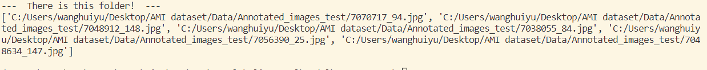
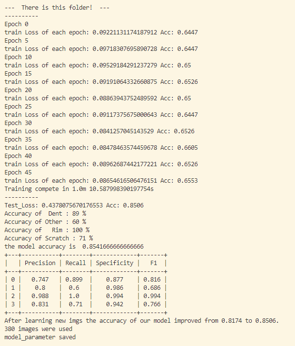
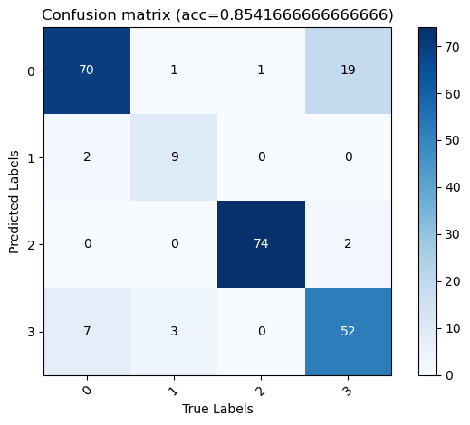

# Resnet_ALWeb

## Contents  
- [Environment](#Environment)  
- [Structure](#Structure)  
- [Usage Description](#Usage-Description) 
- [Algorithm](#Algorithm)
- [Results](#Results) 
- [Functions](#Functions) 

## Environment
* Python 3.7.11
* Pytorch 1.10.2
* The code is tested on Python 3.7.11, with operating system Windows.

## Structure

  ├── [main_select.py](./main_select.py): Read images from uploaded folder and return some most uncertain images path list. 
  ├── [main_train.py](./main_train.py):     
  ├── [Labels](./Labels): Manually labels in csv file. 
  ├── [src](./src): Datasets and subfunctions.  
  ├──── [Combine_dataset.py](./src/Combine_dataset.py) Read combine train dataset and get images from different paths according to ID.  
  ├──── [model_parameter.py](./src/model_parameter.py) set up model.      
  ├──── [create_train.py](./src/create_train.py) Make folder for train set and save train set images  
  ├──── [creterion.py](./src/creterion.py) Create matrix to calculate TN TP FN FP.  
  ├──── [fetch_image.py](./src/fetch_image.py) Get cropped images according to Annotations from WENN dataset and save in folder.  
  ├──── [select_Webimage.py](./src/select_Webimage.py) Select images from uploaded folder using some AL sampling methods.   
  ├──── [Upload_dataset.py](./src/Upload_dataset.py) create dataset for uploaded images.   
  ├──── [WENN_dataset.py](./src/WENN_dataset.py) create WENN dataset and get imgs per index.       
  └── [results](./results): Saved results.     

## Usage Description
#### [main_select.py](./main_select.py)

* Clone or download files.  
* Copy upload image folder path and paste at [main_select.py](./main_select.py): line 48
* Choose what AL sampling methods to be used at [main_select.py](./main_select.py): line 51. 
* Choose how many images are sampled at each round of AL at [main_select.py](./main_select.py): line 50.
* Run function [main_select.py](./main_select.py):  
* Enjoy and have fun! 

#### [main_train.py](./main_train.py)

* Clone or download files.  
* Copy upload image folder path and paste at [main_train.py](./main_train.py): line 188
* Copy WENN dataset path and paste at [main_train.py](./main_train.py) line 189
* Choose what AL sampling methods to be used at [main_train.py](./main_train.py): line 191 
* Choose how many images are sampled at each round of AL at [main_train.py](./main_train.py): line 190
* Give label list manually after seeing imgs shown at [main_train.py](./main_train.py): line 199
* Run function [main_train.py](./main_train.py)  
* Enjoy and have fun!  

## Algorithm  

* This code is used to simulate some functionality on the web.  
* When the user uploads some images on the web, these images will be saved in the folder.  
* Our model makes predictions on newly uploaded images from users barely use [main_select.py](./main_select.py).  
* To further improve the performance of our model, we will use the AL method to pick newly uploaded images.  
* We provide users with four optional AL selection methods and the number of images that users can customize.  
* After that we will present the selected images to the user and ask the user to manually provide labels for these uncertain images.  
* After a subset of the selected new images are labeled, we will let the model continue to learn these images [main_train.py](./main_train.py).  
* Finally, we show the performance of our model after learning new images. New model will be saved.    

## Results  

* Run [main_select.py](./main_select.py) will return selected most uncertain images path.  

* After the model learns the correctly labeled images by running [main_train.py](./main_train.py), the performance of the model improves. 
Accuracy from 81.74% to 85.06% with only 5 new images learned.

#### Functions 
* Users upload images on the web.  
* The model's initial prediction of the uploaded images.  
* User can select one or more methods of AL.  
* User can choose the number of selected iamges.  
* User manually adds labels to the selected images.
* The model is retrained on the newly added images and gets a performance boost.   

#### Written by Huiyu Wang 17.08.2022