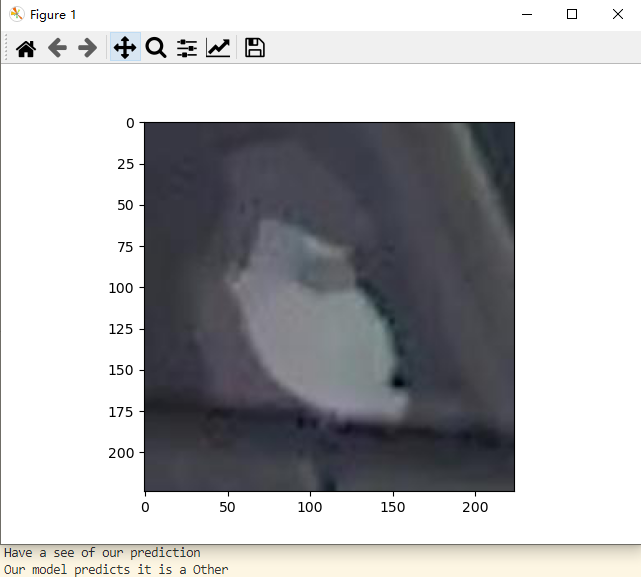

# Resnet_predict

## Contents  
- [Environment](#Environment)  
- [Structure](#Structure)  
- [Usage Description](#Usage-Description) 
- [Results](#Results) 

## Environment
* Python 3.7.11
* Pytorch 1.10.2
* The code is tested on Python 3.7.11, with operating system Windows.

## Structure

  ├── [main.py](./main.py): Extract some images uploaded by users and predict their labels.  
  ├── [src](./src): Dataset and subfunctions.  
  ├──── [Upload_dataset.py](./src/Upload_dataset.py) create dataset for uploaded images.  
  ├──── [model_parameter.py](./src/model_parameter.py) set up model.      
  ├── [Annotated_images_test](./Annotated_images_test): Simulated user uploaded images folder for test.     
  └── [results](./results): Saved results.   

## Usage Description
#### [main.py](./main.py)

* Clone or download files.  
* Copy uploaded image folder path and paste at [main.py](./main.py) line 85 
* Run function [main.py](./main.py)  
* Enjoy and have fun! 
  

## Results  
* You can see the prediction from model.  

 

#### Written by Huiyu Wang 01.08.2022