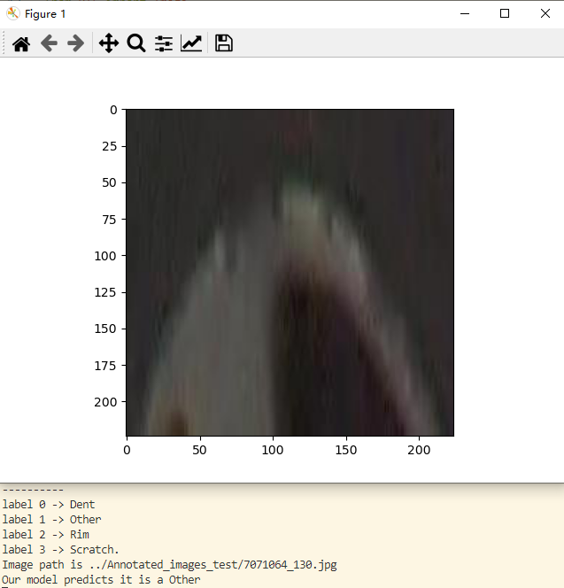
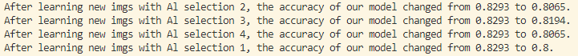

# Simulate web page functionality using AL model

## Contents  
- [Environment](#Environment)  
- [Structure](#Structure)  
- [Usage Description](#Usage-Description) 
- [Algorithm](#Algorithm)
- [Results](#Results) 
- [Functions](#Functions) 

## Environment
* Python 3.7.11
* Pytorch 1.10.2
* The code is tested on Python 3.7.11, with operating system Windows.

## Structure

  ├── [take_Test_sample.py](./take_Test_sample.py): Extract some images from the previous test set to simulate the iamges uploaded by users on the web and save them in a folder.    
  ├── [test_model_web_function_prefect.py](./test_model_web_function_prefect.py): Simulates interactive functionality on the web. It includes predicting, picking, manually adding labels, and retraining.    
  ├── [AL_20_accuracy_0.8293_images_461select_2.csv](./AL_20_accuracy_0.8293_images_461select_2.csv): The set of images used in the previous training.   
  ├── [AL_20_accuracy_0.8293images_461select_2_parameter.pkl](./AL_20_accuracy_0.8293images_461select_2_parameter.pkl): Parameters saved from the previously trained model.  
  └── [Results](./Results): Saved results.   

## Usage Description
#### [take_Test_sample.py](./take_Test_sample.py)

* Clone or download files.  
* Add files to your datasets folder. Same path as annotated_functional_test3_fixed.json.  

* Extract a subset of images from the test set to simulate new images uploaded by users.  
* Change the number of extracted images at [take_Test_sample.py](./take_Test_sample.py) line 35 
* Change path u want to save images from testset [AL_CNN_one.py](./AL_CNN_one.py) line 50
* Run function [take_Test_sample.py](./take_Test_sample.py)  
* Enjoy and have fun! 

#### [test_model_web_function_prefect.py](./test_model_web_function_prefect.py)

* Clone or download files.  
* Add files to your datasets folder. Same path as annotated_functional_test3_fixed.json.  

* Download model pretrain to same path [AL_20_accuracy_0.8293images_461select_2_parameter.pkl](https://drive.google.com/file/d/1clBUIGtIJ95zorp0tWsEGsFFdRwFXkYh/view?usp=sharing)
* Run [take_Test_sample.py](./take_Test_sample.py) to create new images and folder.  
* Change the corresponding real test set size here according to the number of images extracted from the test set. [test_model_web_function_prefect.py](./test_model_web_function_prefect.py) line 40  
* Change the number of times the model is trained [test_model_web_function_prefect.py](./test_model_web_function_prefect.py) line 346  
* Change how many images of the results from our model predictions would you like to see? [test_model_web_function_prefect.py](./test_model_web_function_prefect.py) line 382  
* Change how many images do you want to pick using the AL method [test_model_web_function_prefect.py](./test_model_web_function_prefect.py) line 392  
* Change select_list of AL selection methods. [test_model_web_function_prefect.py](./test_model_web_function_prefect.py) line 396  
* Run function [test_model_web_function_prefect.py](./test_model_web_function_prefect.py)  
* Enjoy and have fun!  

## Algorithm  

* This code is used to simulate some functionality on the web.  
* When the user uploads some images on the web, these images will be saved in the folder.  
* Our model makes predictions on newly uploaded images from users.  
* To further improve the performance of our model, we will use the AL method to pick newly uploaded images.  
* We provide users with four optional AL selection methods and the number of images that users can customize.  
* After that we will present the selected images to the user and ask the user to manually provide labels for these uncertain images.  
* After a subset of the selected new images are labeled, we will let the model continue to learn these images.  
* Finally, we show the performance of our model after learning new images. New model will be saved.    

## Results  
* After the model learns the correctly labeled images, the performance of the model improves. 
Accuracy from 82.93% to 83.23% with only 5 new images learned.

* You can see the prediction from model.  

* You will add labels manually like this.  
  

* If ur labels are not correct, model preformance may be worse.  

#### Functions 
* Users upload images on the web.  
* The model's initial prediction of the uploaded images.  
* User can select one or more methods of AL.  
* User can choose the number of selected iamges.  
* User manually adds labels to the selected images.
* The model is retrained on the newly added images and gets a performance boost.   

#### Written by Huiyu Wang 01.08.2022