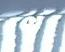

# The dataPreprocess help us to fetch images according to the json file
Before starting damage classification, we must first take out the cropped photos and perform simple image preprocessing, which can be done well through dataPreprocess.

## How to use class dataPreprocess

```
dp = dataPreprocess('annotated_functional_test3_fixed.json', 255, 236)
# fetch images and store these in the Annotated_images folder
dp.fetchImages()
# get X value from the fetching images path
X = dp.getXvaulue()
# directly get X value without fetching images
X = dp.fetchgetXvalue()
```
dataPreprocess provides a variety of ways to obtain image information. It can first take out the image and store it in a specific path, or directly take out the image data and store it in the variable X in a flatten manner. At present, dataPreprocess only directly stores pictures as grayscale photos, and users can modify them according to their needs.

## Some simple examples to utilize the input images
The document provides three simple examples of using the extracted data, KNN classification, principal component analysis and simple multilayer perceptron. Relevant results are displayed directly as pictures.

### K- Nearest Neighbor classification


### Principal Component Analysis to data dimensionality reduction


### Simple Multilayer Perceptron
```
Iteration 1, loss = 0.09582078
Iteration 2, loss = 0.09016440
Iteration 3, loss = 0.08433509
Iteration 4, loss = 0.07817240
Iteration 5, loss = 0.07199455
Iteration 6, loss = 0.06581362
Iteration 7, loss = 0.05960433
Iteration 8, loss = 0.05366140
Iteration 9, loss = 0.04814060
Iteration 10, loss = 0.04313573
Iteration 11, loss = 0.03823530
Iteration 12, loss = 0.03388436
Iteration 13, loss = 0.02999260
Iteration 14, loss = 0.02630303
Iteration 15, loss = 0.02317455
Iteration 16, loss = 0.02063697
Iteration 17, loss = 0.01854632
Iteration 18, loss = 0.01688154
Iteration 19, loss = 0.01571551
Iteration 20, loss = 0.01486326
C:\Users\hanzucheng_hans\AppData\Local\Programs\Python\Python39\lib\site-packages\sklearn\neural_network\_multilayer_perceptron.py:702: ConvergenceWarning: Stochastic Optimizer: Maximum iterations (20) reached and the optimization hasn't converged yet.
  warnings.warn(
The current accuracy of Multilayer Perceptron is 0.471457530674095
```
